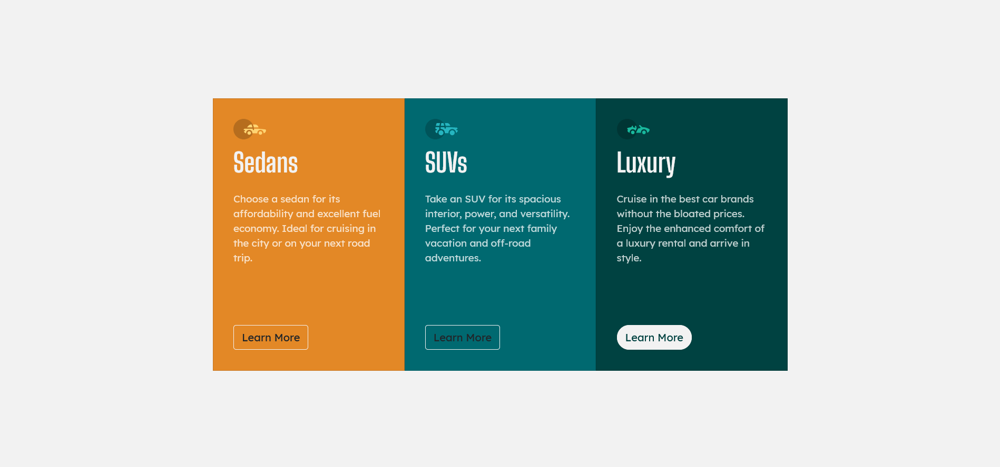

# Frontend Mentor - 3-column preview card component solution

This is a solution to the [3-column preview card component challenge on Frontend Mentor](https://www.frontendmentor.io/challenges/3column-preview-card-component-pH92eAR2-). Frontend Mentor challenges help you improve your coding skills by building realistic projects. 

## Table of contents

- [Overview](#overview)
  - [The challenge](#the-challenge)
  - [Screenshot](#screenshot)
  - [Links](#links)
- [My process](#my-process)
  - [Built with](#built-with)
  - [What I learned](#what-i-learned)
  - [Continued development](#continued-development)
  - [Useful resources](#useful-resources)
- [Author](#author)

## Overview

### The challenge

Users should be able to:

- View the optimal layout depending on their device's screen size
- See hover states for interactive elements

### Screenshot




### Links

- Solution URL: (https://github.com/sumit-raj-au5/Frontend_Mentor/new/main/3-column%20preview%20card%20component)
- Live Site URL:(https://confident-jepsen-839e4e.netlify.app/)

## My process

### Built with

- Semantic HTML5 markup
- CSS custom properties
- Flexbox
- CSS Grid
- Mobile-first workflow
- [Bootstrap](https://getbootstrap.com/) - Bootstrap framework

**Note: These are just examples. Delete this note and replace the list above with your own choices**

### What I learned

Creating card and grouping them together. Making outline button and blend them with background on hover.

```html
<div class="card-group">

        <div class="col-md-4">
          <div class="card h-100 sedans">
            <div class="card-body">
              
              <h1 class="card-title">Sedans</h1>
              <p class="card-text">
                Choose a sedan for its affordability and excellent fuel economy. Ideal for cruising in the city
                or on your next road trip.
              </p>
              <a href="#" class="btn btn-outline">Learn More</a>
            </div>
          </div>
        </div>
```
```css
.btn{
    border-radius: 40px;
    border-color: hsl(0, 0%, 95%);
    background-color: hsl(0, 0%, 95%);
}
.sedans .btn-outline{
    color:hsl(31, 77%, 52%);
}

.sedans .btn-outline:hover{
    background-color: hsl(31, 77%, 52%);
    color:hsl(0, 0%, 95%);
}
```

### Continued development

I am planning to continue frontend practice and learn more about bootstrap components and UI design.

### Useful resources

- [Card Group](https://getbootstrap.com/docs/5.0/components/card/#card-groups) - This helped me making card and grouping them together. 

## Author

- Website - [Sumit Raj](#)
- Frontend Mentor - [@sumit-raj-au5](https://www.frontendmentor.io/profile/sumit-raj-au5)
- Twitter - [@dev_sumit_raj](https://www.twitter.com/@dev_sumit_raj)
