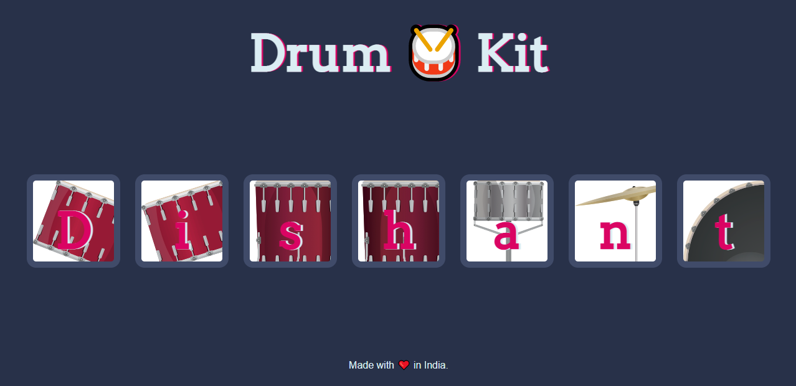

# Drum Kit

Click on any drum in the typical drumset to get corresponding sound of the drum and in addition you can also use the keys on the keyboard.



## Getting Started

Start by cloning the repo : 
```sh
git clone https://github.com/dishantagg24/drum-kit
```
Or Download and extract the zip file.
### Prerequisites

* A modern-web browser like Brave , Chrome , Firefox etc
* Computer..

### Running

1. Double-Click on index.html file or Open it with your favourite browser.

## Built With

* [Javascript](https://www.javascript.com/) - High-level, interpreted programming language
* [HTML](https://www.html.com/) - Standard markup language
* [CSS](https://css.com) - Style sheet language

## Authors

* **[Dishant Aggarwal](https://github.com/dishantagg24)**

## License

This project is licensed under the MIT License - see the [LICENSE.md](https://github.com/dishantagg24/drum-kit/blob/master/LICENSE) file for details
