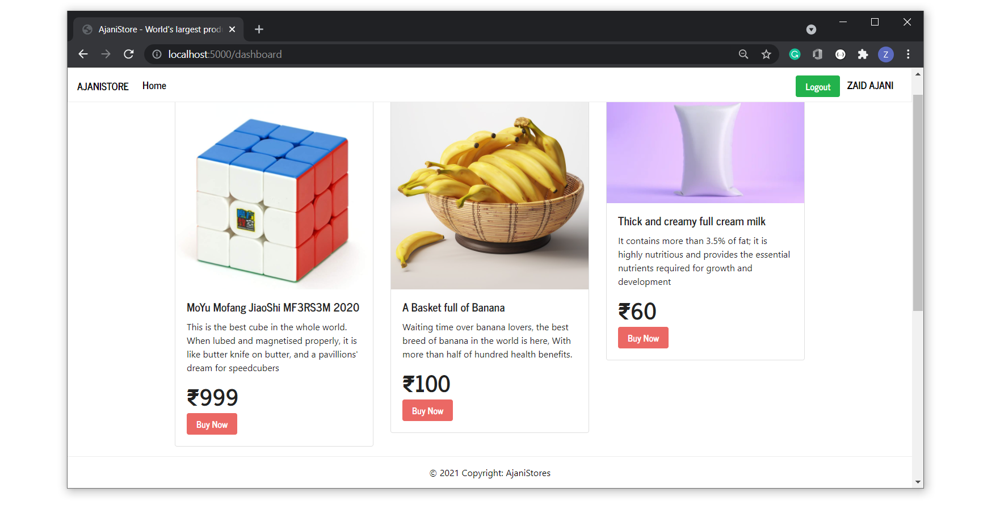

## E-commerce Application in Node js



#### Made fully using node.js and express ( including other libraries ).

### Libraries used

1. bcryptjs
2. config
3. connect-flash
4. cors
5. crud-db
6. ejs
7. express
8. express-ejs-layouts
9. express-fileupload
10. express-session
11. idgp
12. joi
13. jsonwebtoken
14. lodash
15. mongoose
16. multer
17. nodemailer
18. passport
19. passport-local

### To add products, interact with the `api` and do same to become a moderator. 

Note: You should have Node.js and MongoDb installed in your system.

### Project Startup

Open terminal, clone this project and execute the following.

```sh
$ npm install

$ npm run dev
```

This will start your development server.

Dont forget to start mongodb:

#### Windows

```sh
PS C:/User/Documents/Development> mongod
```
#### Mac and other unix based

```sh
$ sudo mongod
```

### Enjoy your powerfull application.
