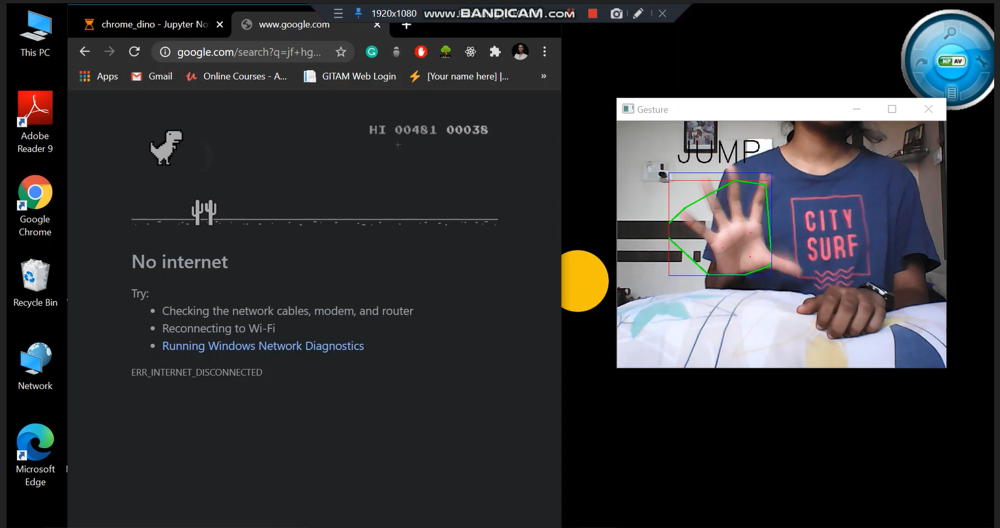
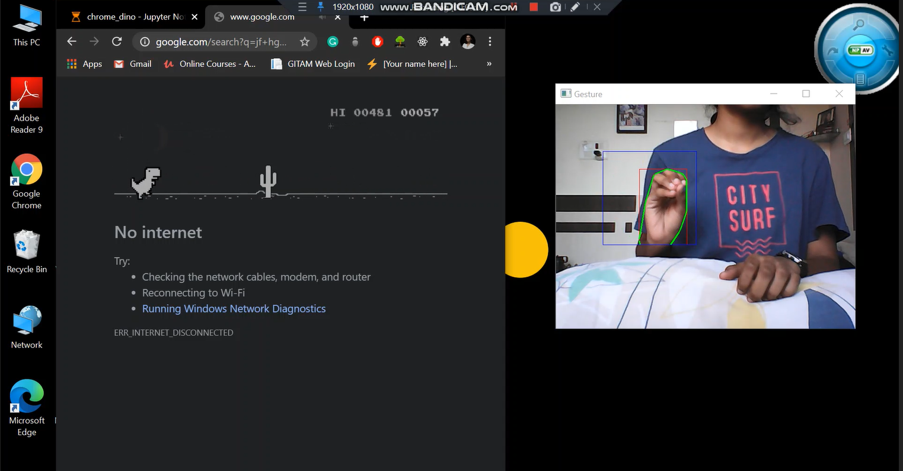

# Chrome Dinosaur Game

### Libraries used:
1. NumPy (Python Package)
2. OpenCV
3. PyAutoGUI (Python Module)

### Steps:
1. Open up the camera and draw a rectangle
2. Blur the image and convert it from BGR to HSV
3. Threshold and mask the image
4. Contour the image
5. Run the code and play!

Step-1: Open the camera to read input and draw a rectangle on the frame. I used a built-in function of OpenCV to draw the rectangle. Also, read the hand image from the frame. Feel free to change the frame size!

Step-2: Smoothen the input image using Gaussian Blur. Image smoothing techniques help in reducing the noise. Gaussian blur is used to reduce the amount of noise and remove dark spots (speckles) within the image. HSV (Hue, Saturation and Lightness) separates the image intensity from the colour information. Hence, I preferred HSV over BGR and converted the initial BGR image into HSV.

Step-3: Erosion, dilation and thresholding. Erosion helps in eroding away the boundaries of foreground object. Dilation is the exact opposite of osion. It helps in increasing the foreground object (increases the white region in the image). Thresholding is a method of image segmentation. It is used to create binary objects. If pixel value is greater than the threshold value, it is assigned one value (white), otherwise it is assigned another value (black). Take note that the larger the kernel value is, the more blurred the image will be.

Step-4: Detecting contours. Wherever a white (skin colour) pixel is detected, an outline will be drawn. To detect the outline of my palm, I used cv2.moments and found out the centroid of the contour. When your palm is detected completely, space bar will be pressed so the T-Rex can jump. When your palm is not detected, the T-Rex will not jump (it just runs). This is done with the help of PyAutoGUI. PyAutoGUI is a cross-platform GUI automation Python module for human beings. Using PyAutoGUI, we can control the mouse and the keyboard just by writing a few lines of code.

Step-5: Exit the capture window by pressing the key ‘q’.

Step-6: Finally, run the program (it might take a while depending on the speed of your computer). Make sure you keep your hand in the rectangle that is visible on the screen. You may change the dimensions of it according to your convenience.

### Dinosaur Jump

### Dinosaur Run

### End.

 
