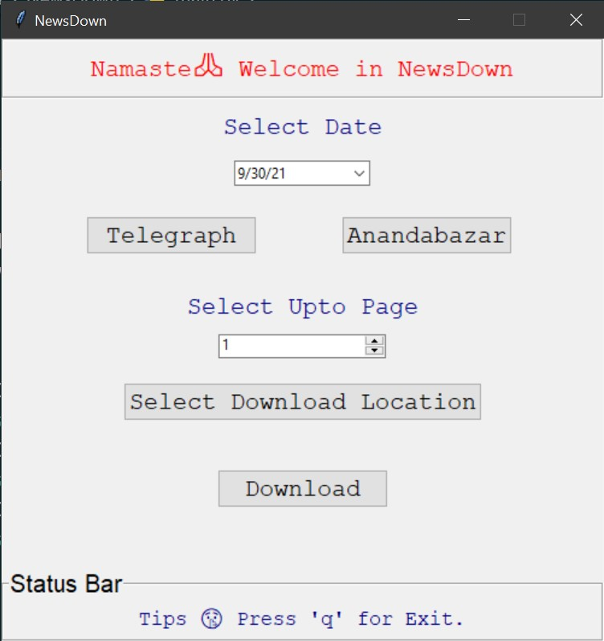

<a href="https://dev.to/iambikrampurkait">
  
</a>

 # NewsDown 

 ## About   
 **NewsDown** is a Newspaper Downloader. It is built in Python using tkinter and it scrape the official newspaper site and download newspaper.     

## Features   
Currently you can download Anandabazaar and Telegraph Newspaper. Adding new newspaper for download  is highly appreciable.

## Install the Dependencies

To use this first you need to make sure, Python3 is installed in your system.
To install Python3 in your system you may checkout Python's official downloads [page](https://www.python.org/downloads/).

## How to Run

First thing you need to do is to clone the repository. Run the following command in your terminal to clone the repository:
```bash
git clone repolink
```
Next you have to install all the dependent modules which I have listed in ```requirements.txt``` file.
To install the required modules simply run the following inside your terminal: 
```python
pip install -r requirements.txt
```
Finally to run the this all you have to do is to run the ```main.py``` file as shown:
```
python main.py
```
Now you can download newspaper in one click.

## Screenshot


## Sample Pdf
[The Telegraph Newspaper](https://drive.google.com/file/d/1mg5IfRKXx4tARzHDBcyIQmfIOAHIVUp5/view?usp=sharing)  

[Anandabazaar Newspaper](https://drive.google.com/file/d/1X8frclEovqGv6myiSnu0ywHWMXy23-Sz/view?usp=sharing)

## Credit
Project name suggest by [Souhit Dey](https://github.com/OBITORASU)
