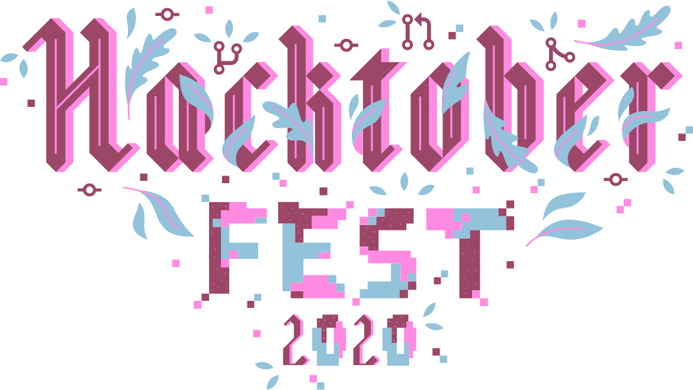

    

<h1 align="center"> Hacktoberfest 2020 🎉</h1>

  

 
 

 

### 🗣 Hacktoberfest encourages participation in the open source community, which grows bigger every year. Complete the 2020 challenge and earn a limited edition T-shirt.

📢 **Register [here](https://hacktoberfest.digitalocean.com) for Hacktoberfest and make four pull requests (PRs) between October 1st-31st to grab free SWAGS 🔥.**

> Add important code, files or project in **Hactoberfest2020** folder, this folder is present in each resporatory ,now send your first PR! 

| Repository  | Issues  | Pull Requests  | Forks |
|---|---|---|---|
| [Python](https://github.com/keshavsingh4522/Python)  |  |   |  |
| [C](https://github.com/keshavsingh4522/c/) |   |   |  |
| [Javascript](https://github.com/keshavsingh4522/javascript) |   |   |  |
| [jQuery](https://github.com/keshavsingh4522/jquery) |   |   |  |
| [Bootstrap](https://github.com/keshavsingh4522/Bootstrap/) |   |  |  |
| [HTML5](https://github.com/keshavsingh4522/HTML5/) |   |   |  |

## Rules

- Don't use dirty words and be welcome for beginners and other people in this community.
- Add your code,files or project in **Hactoberfest2020** folder, this folder is present in each resporatory which is mentioned above

## License 

To the extent possible under law, [Keshav Singh](https://www.linkedin.com/in/keshavsingh4522/) has waived all copyright and related or neighboring rights to this work.

***
Steps for adding your name below

    1. Fork this repo
    2. Edit this file to include your information under "Participants"
    3. Add your Name also link your github profile
    4. Make pull request

<h1 align="center">Participents</h1>

| Name | Github |
| ---- | ------ |
| Keshav Singh | [@keshavsingh4522](https://github.com/keshavsingh4522/) |
